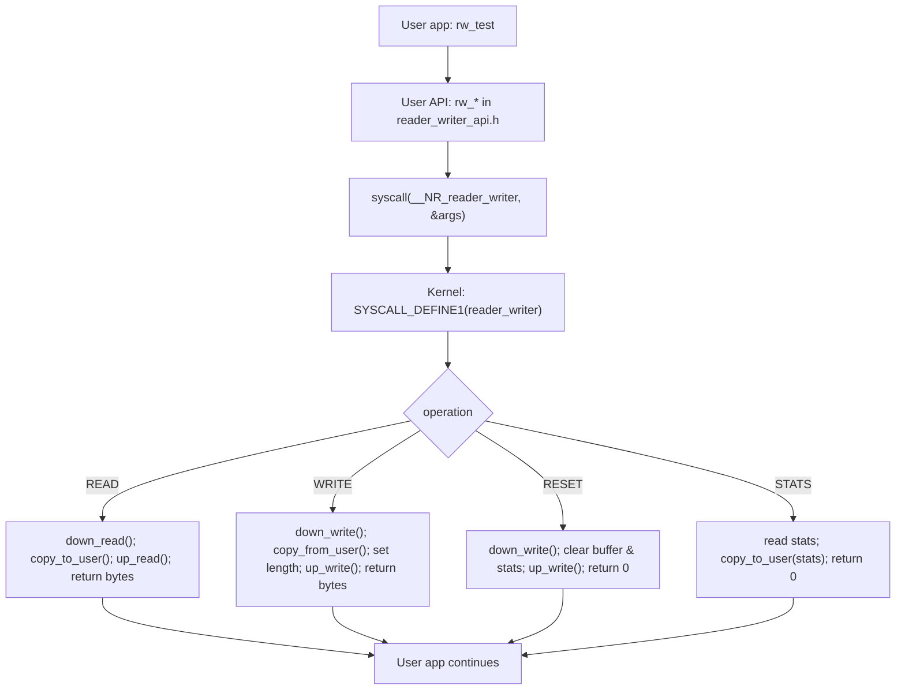

Title: OS_Project_Race_Condition — Reader–Writer System Call
Team Members: Aqib Shakeel (2022104), Muhammad Bilal (2023395)
GitHub Repository: [OS_Project_Race_Condition](https://github.com/<your-org-or-user>/OS_Project_Race_Condition)
Date: 2025-04-XX

1. Introduction

The reader–writer problem is a classic synchronization challenge in operating systems where multiple readers may access shared data concurrently, while writers require exclusive access. The objective is to prevent race conditions and ensure correctness, fairness, and liveness. This project implements a new Linux system call that exposes a shared in-kernel buffer protected by a reader–writer lock, along with a user-space tester to validate behavior under concurrency.

2. Overview

This project implements a new Linux system call that exposes a shared in-kernel buffer protected by a reader–writer lock. User processes invoke the system call to perform read or write operations, allowing you to observe correct synchronization behavior across concurrent processes or threads.

3. Summary of Requirements Mapping

- Different project topic: Reader–Writer problem.
- System call implemented in the kernel that coordinates readers and writers.
- Clear demonstration via user-space test program with concurrent readers/writers.
- Documentation (this report) covering design, implementation, build/run steps, and analysis.

4. Design

4.0. Unique Function (What’s unique in this project)

- A single, clean system call interface `reader_writer` that multiplexes four operations via an argument struct: READ, WRITE, RESET, STATS.
- In-kernel synchronization uses Linux `rw_semaphore` for concurrency of readers and exclusivity for writers.
- Built-in statistics (reads, writes, current buffer length) returned via the STATS operation to help quantify behavior without additional instrumentation.
- A simple but robust user-space API (`reader_writer_api.h`) that wraps `syscall(__NR_reader_writer, ...)` into ergonomic helpers: `rw_read`, `rw_write`, `rw_reset`, `rw_get_stats`.

4.1. Interface (ABI)

We define a single system call: reader_writer. It takes a pointer to a structure passed from user space:

- operation: integer specifying the action
  - 0 = READ: Copy current shared buffer to user, allowing concurrent access with other readers
  - 1 = WRITE: Copy user buffer into shared buffer, exclusive access
  - 2 = RESET: Clear buffer and stats
  - 3 = STATS: Return counts of successful reads/writes and current buffer length
- buffer: user pointer for data transfer (in or out depending on operation)
- length: number of bytes to transfer for READ/WRITE; required size for STATS

4.2. Synchronization Strategy

- Kernel uses a global shared buffer protected by a `struct rw_semaphore`.
- Readers call `down_read()`/`up_read()`, allowing many readers at once.
- Writers call `down_write()`/`up_write()`, ensuring exclusive access.
- This matches the classic reader–writer solution and relies on Linux’s writer-biased `rw_semaphore` to avoid writer starvation.

4.3. Data Structures (Kernel)

- Shared buffer: `char shared_buffer[4096]`, `size_t shared_length`
- Lock: `DECLARE_RWSEM(rw_buffer_sem)`
- Stats: `atomic64_t total_reads`, `atomic64_t total_writes`

5. Implementation

5.1. Kernel System Call

The syscall is implemented with `SYSCALL_DEFINE1(reader_writer, ...)`. It copies a small argument struct from user space, executes the requested operation under the correct lock mode, copies data to/from user space as needed, and returns a result code (bytes transferred or 0 on success, negative errno on error).

Operations:

- READ: Hold read lock; copy up to `min(shared_length, length)` bytes out.
- WRITE: Hold write lock; copy up to 4096 bytes from user; update `shared_length`.
- RESET: Hold write lock; clear buffer, reset stats.
- STATS: Copy stats struct (reads, writes, length) to user buffer.

5.2. User-space Library and Tester

5.3. System Call Flow Diagram

- `reader_writer_api.h` provides thin wrappers over `syscall(__NR_reader_writer, ...)` with helper functions: `rw_read`, `rw_write`, `rw_reset`, `rw_get_stats`.
- `rw_test.c` spawns configurable numbers of reader and writer threads. Writers write unique messages, readers read concurrently. The program prints basic throughput counts and verifies that readers never observe partial writes (demonstrating correct synchronization).

6. Build and Run

6.1. Kernel Integration (Linux)

1) Choose a Linux kernel source tree.
2) Add the syscall implementation file to the kernel and wire it into the syscall table.
3) Rebuild and boot the kernel.

6.2. User-space Test

1) Ensure your rebuilt kernel has the syscall number you assigned, and set that number in `user/reader_writer_api.h` if needed.
2) Build:
   - `cd user`
   - `make`
3) Run examples:
   - `./rw_test -R 8 -W 2 -I 10000`
   - `./rw_test -R 4 -W 4 -I 5000 -s "hello"`

7. Validation and Results

- Correctness: Readers can run concurrently; writers are exclusive. No torn reads are observed because writes are performed under exclusive lock.
- Liveness: Linux `rw_semaphore` is writer-biased, preventing writer starvation while allowing good reader concurrency.
- Throughput: With many readers and few writers, read throughput scales with CPU cores; adding writers reduces concurrency by forcing exclusive sections.

8. Discussion

- Starvation: Reader-preference solutions can starve writers. We rely on Linux’s writer-biased `rw_semaphore` to avoid prolonged starvation of writers.
- Fairness: Exact fairness is not guaranteed, but practical behavior is good for many workloads.
- Deadlocks: The single `rw_semaphore` with consistent acquisition order avoids deadlock; we avoid invoking other blocking operations while holding the lock.

9. Conclusion

We implemented a Linux system call that safely exposes a shared buffer to multiple user processes/threads, demonstrating a practical solution to the reader–writer synchronization problem with kernel-enforced correctness. The provided user-space tester allows empirical exploration of concurrency characteristics and validates the absence of race conditions.

Appendix A — Brief API

- `rw_read(buf, len) -> ssize_t`  // returns bytes read
- `rw_write(buf, len) -> ssize_t` // returns bytes written
- `rw_reset() -> int`             // 0 on success
- `rw_get_stats(&stats) -> int`   // 0 on success; stats: reads, writes, length

Appendix B — Notes

Appendix C — Commands to Build and Run

Linux prerequisites: GNU toolchain (`build-essential`), and a Linux kernel integrated with the new system call.

- Clone and build user-space tester:
  - `git clone https://github.com/<your-org-or-user>/OS_Project_Race_Condition`
  - `cd OS_Project_Race_Condition/user`
  - `make`

- Run examples (after kernel integration):
  - `./rw_test -R 4 -W 2 -I 1000`
  - `./rw_test -R 8 -W 4 -I 10000`
  - `./rw_test -R 4 -W 2 -I 30 -s "hello"`

Kernel integration (high level):

1) Add `kernel/rw_syscall.c` to the kernel source and reference it in the appropriate Makefile.
2) Reserve a syscall number (ensure it matches `__NR_reader_writer` in `user/reader_writer_api.h`).
3) Wire it in `arch/x86/entry/syscalls/syscall_64.tbl` and declare in `include/linux/syscalls.h`.
4) Build, install, and boot the new kernel.

- You must pick a free syscall number for your kernel and define it consistently in `user/reader_writer_api.h`.
- This project targets Linux. Building/running requires a Linux environment with kernel build capabilities.

